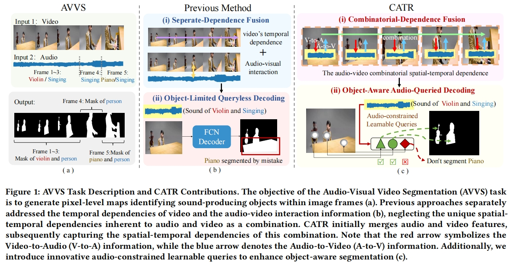

This repo contains the official implementation of the **ACM MM 2023** [paper](https://arxiv.org/abs/2309.09709): 

<h1>
<b>
CATR: Combinatorial-Dependence Audio-Queried Transformer  for Audio-Visual Video Segmentation
</b>
</h1>
<h4>
<b>
Kexin Li, Zongxin Yang∗, Lei Chen, Yi Yang, Jun Xiao
</b>
</h4>

## Motivation

## Environment Installation
The code was tested on a Conda environment with CUDA Version as 11.7.
Install [Conda](https://docs.conda.io/en/latest/miniconda.html) and then create an environment as follows:

`conda create -n catr python=3.8.17 pip -y`

`conda activate catr`

- Pytorch 2.0.0:

`conda install pytorch==2.0.0 torchvision==0.15.0 torchaudio==2.0.0 pytorch-cuda=11.7 -c pytorch -c nvidia`

Note that you might have to change the cudatoolkit version above according to your system's CUDA version.
- Hugging Face transformers 4.11.3:

`pip install transformers==4.11.3`

- Additional required packages:

`pip install h5py wandb opencv-python protobuf av einops ruamel.yaml timm joblib`

`conda install -c conda-forge pandas matplotlib cython scipy cupy`

## Running Configuration
Parameter Settings are divided into fixed parameters and adjustable parameters.

The following table lists the parameters which can be configured directly from the command line.

The rest of the fixed parameters for each dataset can be configured in `configs/DATASET_NAME.yaml`.

| Command      | Description | 
| :-----------: | :-----------: | 
| -visual_backbone  | resnet50 or pvt |
| -log_dir  | the path to save train logs|
| -config_path  | the path for fixed parameters |
| -train_batch_size  | training batch size per GPU |
| -val_batch_size  | eval batch size per GPU |
| -max_epoches  | the max number of epoches to run|

## Data Preparation
MS(Fully-supervised Multiple-sound Source Segmentation): [https://forms.gle/GKzkU2pEkh8aQVHN6](https://forms.gle/GKzkU2pEkh8aQVHN6)  
S4(Semi-supervised Single-sound Source Segmentation): [https://forms.gle/GKzkU2pEkh8aQVHN6](https://forms.gle/GKzkU2pEkh8aQVHN6)  
AVSS( Fully-supervised Audio-Visual Semantic Segmentation): [https://forms.gle/15GZeDbVMe2z6YUGA](https://forms.gle/15GZeDbVMe2z6YUGA)  

## Pretrained Backbones

The pretrained backbones can be downloaded from [here](https://drive.google.com/drive/folders/1nD0IV88kuil2QSw2ZR5dE9j7M-tRnvm8) and placed to the directory `pretrained_backbones`.

## Config File
The Config File can be downloaded from [here](https://pan.baidu.com/s/1rpUEAsSMptEChkl3v3prGg?pwd=tybr) The extraction code is 'tybr'.

## Framework

